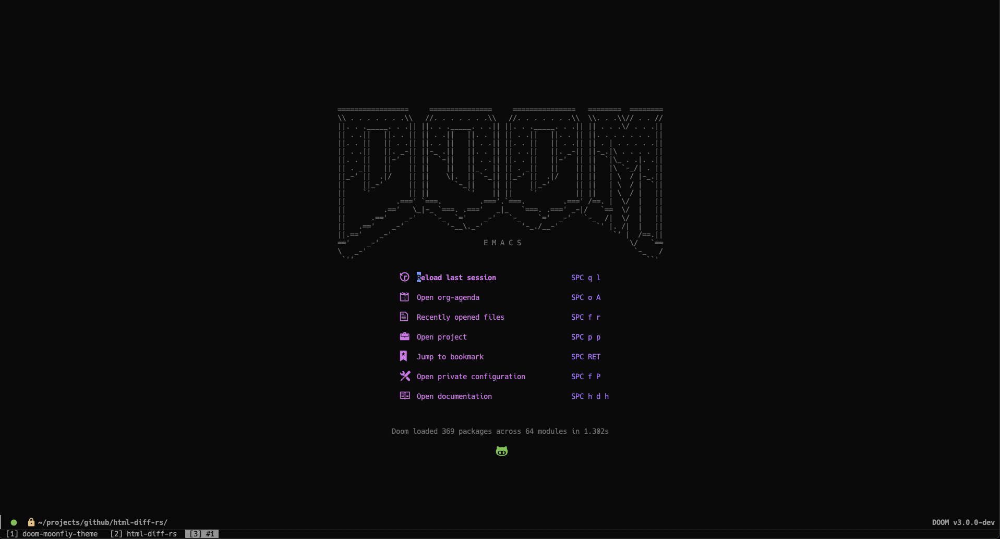
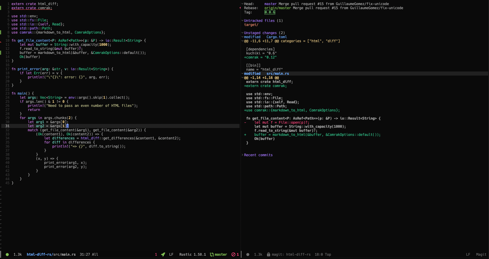

# Doom Moonfly theme

This is a port of
[vim-moonfly-colors](https://github.com/bluz71/vim-moonfly-colors) for [Doom
Emacs](https://github.com/hlissner/doom-emacs).

NOTE: it's still a work in progress. Screenshots are outdated. Will change them
soon.

## screenshots





## Manual Installation

Drop `doom-moonfly-theme.el` in your `~/.doom.d/themes/` directory.

## Using `package!`

Add the following to your `~/.doom.d/packages.el`

```lisp
(package! doom-moonfly-theme
  :recipe (:host github
           :repo "stackmystack/doom-moonfly-theme"))
```

## Set

```lisp
(setq doom-theme 'doom-moonfly)
```
